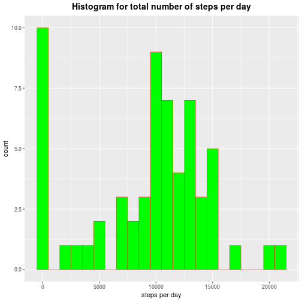
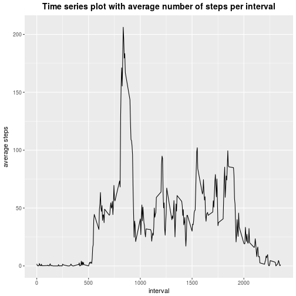
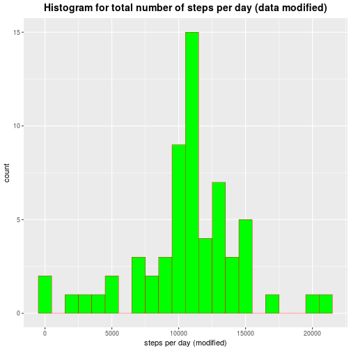
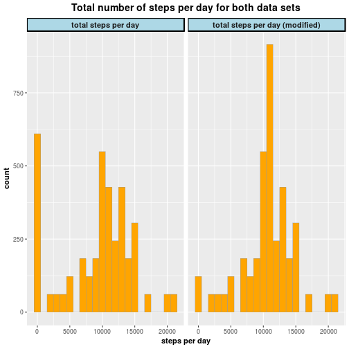
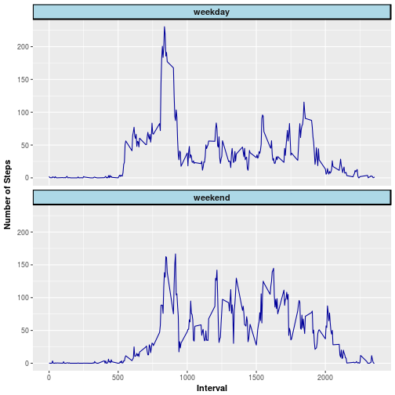

```r
---
title: "Reproducible Research - Course Project 1"
author: "S. Grath"
date: "November 24, 2017"
output: html_document
keep_md: true
---

##Activity Monitoring Data
###Loading and preprocessing the data
```

```
## Error: <text>:12:0: unexpected end of input
## 10: ###Loading and preprocessing the data
## 11: 
##    ^
```

```r
#Load activity data
myActivityData <- read.table("activity.csv", sep = ",", header = TRUE)
#Some controls
summary(myActivityData)
```

```
##      steps                date          interval     
##  Min.   :  0.00   2012-10-01:  288   Min.   :   0.0  
##  1st Qu.:  0.00   2012-10-02:  288   1st Qu.: 588.8  
##  Median :  0.00   2012-10-03:  288   Median :1177.5  
##  Mean   : 37.38   2012-10-04:  288   Mean   :1177.5  
##  3rd Qu.: 12.00   2012-10-05:  288   3rd Qu.:1766.2  
##  Max.   :806.00   2012-10-06:  288   Max.   :2355.0  
##  NA's   :2304     (Other)   :15840
```

```r
str(myActivityData)
```

```
## 'data.frame':	17568 obs. of  3 variables:
##  $ steps   : int  NA NA NA NA NA NA NA NA NA NA ...
##  $ date    : Factor w/ 61 levels "2012-10-01","2012-10-02",..: 1 1 1 1 1 1 1 1 1 1 ...
##  $ interval: int  0 5 10 15 20 25 30 35 40 45 ...
```

```r
names(myActivityData)
```

```
## [1] "steps"    "date"     "interval"
```

###What is mean total number of steps taken per day?

For this part of the assignment, I ignored the missing values in the dataset.


```r
#Calculate the mean - ignore na values
meanStepsDay <- tapply(myActivityData$steps, 
                       myActivityData$date, 
                       sum, 
                       na.rm = TRUE)
#Convert into data frame
meanStepsDay <- as.data.frame(as.matrix(tapply(myActivityData$steps, 
                                               myActivityData$date, 
                                               sum, 
                                               na.rm = TRUE)))
#Change column names
colnames(meanStepsDay) <- c("totalStepsDay")
#Print data frame
meanStepsDay
```

```
##            totalStepsDay
## 2012-10-01             0
## 2012-10-02           126
## 2012-10-03         11352
## 2012-10-04         12116
## 2012-10-05         13294
## 2012-10-06         15420
## 2012-10-07         11015
## 2012-10-08             0
## 2012-10-09         12811
## 2012-10-10          9900
## 2012-10-11         10304
## 2012-10-12         17382
## 2012-10-13         12426
## 2012-10-14         15098
## 2012-10-15         10139
## 2012-10-16         15084
## 2012-10-17         13452
## 2012-10-18         10056
## 2012-10-19         11829
## 2012-10-20         10395
## 2012-10-21          8821
## 2012-10-22         13460
## 2012-10-23          8918
## 2012-10-24          8355
## 2012-10-25          2492
## 2012-10-26          6778
## 2012-10-27         10119
## 2012-10-28         11458
## 2012-10-29          5018
## 2012-10-30          9819
## 2012-10-31         15414
## 2012-11-01             0
## 2012-11-02         10600
## 2012-11-03         10571
## 2012-11-04             0
## 2012-11-05         10439
## 2012-11-06          8334
## 2012-11-07         12883
## 2012-11-08          3219
## 2012-11-09             0
## 2012-11-10             0
## 2012-11-11         12608
## 2012-11-12         10765
## 2012-11-13          7336
## 2012-11-14             0
## 2012-11-15            41
## 2012-11-16          5441
## 2012-11-17         14339
## 2012-11-18         15110
## 2012-11-19          8841
## 2012-11-20          4472
## 2012-11-21         12787
## 2012-11-22         20427
## 2012-11-23         21194
## 2012-11-24         14478
## 2012-11-25         11834
## 2012-11-26         11162
## 2012-11-27         13646
## 2012-11-28         10183
## 2012-11-29          7047
## 2012-11-30             0
```

```r
#Plot histogram
library(ggplot2)
ggplot(meanStepsDay, aes(x=totalStepsDay)) + 
    geom_histogram(binwidth = 1000, 
                   fill = "green", 
                   colour = "red", 
                   size=0.2) + 
    labs(title="Histogram for total number of steps per day") +
    labs(x="steps per day", y="count") + 
    theme(
        plot.title = element_text(color="black", 
                                  size=14, 
                                  face="bold", 
                                  hjust = 0.5)
    )
```



```r
ggsave("1.Histogram.pdf")
```

```
## Saving 7 x 7 in image
```

```r
#Calculate mean and median
meanSteps <- as.integer(mean(meanStepsDay$totalStepsDay))
medianSteps <- as.integer(median(meanStepsDay$totalStepsDay))
```

The average number of steps per day is 9354. The median number of steps per day is 10395. Note that I gave the mean and median numbers as integers. In my opinion, only full steps make sense here.

###What is the average daily activity pattern?

First, I made a time series plot of the 5-minute interval (x-axis) and the average number of steps taken, averaged over all days (y-axis). Second, I calculated the 5-minute interval, that, on average across all days in the dataset, contains the maximum number of steps.


```r
intervalSteps <- aggregate(myActivityData$steps, 
                           list(myActivityData$interval), 
                           mean, 
                           na.rm = TRUE)
colnames(intervalSteps) <- c("interval", "averageSteps")
ggplot(intervalSteps, aes(interval, averageSteps)) + 
    geom_line() +
    labs(title="Time series plot with average number of steps per interval") +
    labs(y="average steps", x="interval") + 
    theme(
        plot.title = element_text(color="black", 
                                  size=14, 
                                  face="bold", 
                                  hjust = 0.5)
    )
```



```r
ggsave("2.TimeSeriesPlot.pdf")
```

```
## Saving 7 x 7 in image
```

```r
mostSteps <- intervalSteps[which.max(intervalSteps$averageSteps), ]
myInterval <- mostSteps$interval
mySteps <- as.integer(mostSteps$averageSteps)
```

The **interval with the maximum number of steps** on average is: 835 <br>
This interval has on average 206 steps. Again, the step value is given as integer.

###Imputing missing values

Note that there are a number of days/intervals where there are missing values (coded as NA). The presence of missing days may introduce bias into some calculations or summaries of the data.<br>
First, I calculated and reported the total number of missing values in the dataset (i.e. the total number of rows with NAs). Second, I defined a strategy for filling in all missing values in the dataset. I used the mean for any given 5-minute interval. Third, I created a new dataset that is equal to the original dataset but with the missing data filled in. Last, I draw a histogram of the total number of steps taken each day and calculated and reported the mean and median total number of steps taken per day.


```r
missingValues<- is.na(myActivityData$steps)
missingValuesTotal <- sum(as.numeric(missingValues))
```

The **total number of missing values** (rows with NA) is:** 2304


```r
for (i in 1:length(myActivityData$steps)){
    if (is.na(myActivityData$steps[i] == TRUE)){        
        myActivityData$steps[i] <- 
            intervalSteps$averageSteps[match(myActivityData$interval[i], 
                                             intervalSteps$interval)]  
    } 
}

meanStepsDayModified <- as.data.frame(as.matrix(tapply(myActivityData$steps, 
                                                       myActivityData$date, 
                                                       sum)))
colnames(meanStepsDayModified) <- c("totalStepsDayModified")

ggplot(meanStepsDayModified, aes(x=totalStepsDayModified)) + 
    geom_histogram(binwidth = 1000, 
                   fill = "green", 
                   colour = "red", 
                   size=0.2) + 
    labs(title="Histogram for total number of steps per day (data modified)") +
    labs(x="steps per day (modified)", y="count") + 
    theme(
        plot.title = element_text(color="black", 
                                  size=14, 
                                  face="bold", 
                                  hjust = 0.5)
    ) 
```



```r
ggsave("3.HistogramModifiedData.pdf")
```

```
## Saving 7 x 7 in image
```

```r
#Calculate mean and median
meanStepsModified <- as.integer(mean(meanStepsDayModified$totalStepsDayModified))
medianStepsModified <- as.integer(median(meanStepsDayModified$totalStepsDayModified))
```

The **mean number of steps** in the modified dataset is: 10766.
The **median number of steps** in the modified dataset is: 10766.<br>

To compare the original with the modified dataset, I draw histograms of the total number of steps per day for both datasets next to each other. You can see, that in the modified dataset the number of times with 0 steps per day decreases, while the numbers of times with average steps per day (e.g. 10 000 steps) increase.


```r
#Direct comparison of original data set with modified data set
combination <- merge(meanStepsDay, meanStepsDayModified)
library(reshape2)
combination <- melt(combination)
```

```
## No id variables; using all as measure variables
```

```r
colnames(combination) <- c("type", "totalStepsDay")

labels <- c(totalStepsDay = "total steps per day", 
            totalStepsDayModified = "total steps per day (modified)")
ggplot(combination, aes(x=totalStepsDay)) + 
    geom_histogram(binwidth = 1000, 
                   fill = "orange", 
                   colour = "grey60", 
                   size=0.2) + 
    facet_grid(.~ type, 
               labeller = labeller(type = labels)) +
    labs(title="Total number of steps per day for both data sets") +
    labs(x="steps per day", y="count") + 
    theme(
        plot.title = element_text(color="black", 
                                  size=14, 
                                  face="bold", 
                                  hjust = 0.5)
    ) +
    theme(axis.title = element_text(face = "bold", 
                                    size = rel(1.0)),
          strip.text = element_text(face = "bold", 
                                    size = rel(1.0)),
          strip.background = element_rect(fill="lightblue", 
                                          colour = "black", 
                                          size = 1))
```



```r
ggsave("4.HistogramsComparison.pdf")
```

```
## Saving 7 x 7 in image
```

###Are there differences in activity patterns between weekdays and weekends?

For this part of the assignment, I used the weekdays() function and the dataset with the filled-in missing values.<br>


```r
#Add the day-of-week column
myActivityData$day <- weekdays(as.Date(myActivityData$date), abbreviate=FALSE)

#Convert day-of-week column vales to Weekday or Weekend
#CAUTION! German system of date format - Samstag = Saturday, Sonntag = Sunday
#Script would work for both English and German day names
for (i in 1:length(myActivityData$day)){
    if (myActivityData$day[i] == "Samstag" 
        || myActivityData$day[i] == "Sonntag"
        || myActivityData$day[i] == "Saturday" 
        || myActivityData$day[i] == "Sunday"){
        myActivityData$day[i] <- "Weekend"
    } else {
        myActivityData$day[i] <- "Weekday"
    }
}

#Subset the data based on 'day' (Weekend or Weekday)
activityDataWeekend <- subset(myActivityData, day == "Weekend")
activityDataWeekday <- subset(myActivityData, day == "Weekday")

#Calculate the average interval steps for weekend and weekdays separetely
activityIntervalStepsWeekend <- aggregate(activityDataWeekend$steps, 
                                          list(activityDataWeekend$interval), 
                                          mean, 
                                          na.rm = TRUE)
activityIntervalStepsWeekday <- aggregate(activityDataWeekday$steps, 
                                          list(activityDataWeekday$interval), 
                                          mean)
#Change colnames
colnames(activityIntervalStepsWeekend) <- c("interval", "weekend")
colnames(activityIntervalStepsWeekday) <- c("interval", "weekday")

#Combine in one data frame
DF <- merge(activityIntervalStepsWeekday, activityIntervalStepsWeekend)
DF <- melt(DF, id = "interval")

#Plot
colnames(DF) <- c("interval", "type", "numberSteps")
ggplot(DF, aes(interval,  numberSteps)) + 
    geom_line(colour="#000099") + 
    facet_wrap(~ type, nrow = 2) +
    labs(x="Interval", y="Number of Steps") + 
    theme(axis.title = element_text(face = "bold", size = rel(1.0)),
          strip.text = element_text(face = "bold", size = rel(1.0)),
          strip.background = element_rect(fill="lightblue", 
                                          colour = "black", 
                                          size = 1))
```



```r
ggsave("5.ComparisonWeekendWeekday.pdf")
```

```
## Saving 7 x 7 in image
```


```r
sessionInfo()
```

```
## R version 3.3.3 RC (2017-02-27 r72279)
## Platform: x86_64-pc-linux-gnu (64-bit)
## Running under: Ubuntu 16.04.3 LTS
## 
## locale:
##  [1] LC_CTYPE=en_GB.UTF-8       LC_NUMERIC=C              
##  [3] LC_TIME=de_DE.UTF-8        LC_COLLATE=en_GB.UTF-8    
##  [5] LC_MONETARY=de_DE.UTF-8    LC_MESSAGES=en_GB.UTF-8   
##  [7] LC_PAPER=de_DE.UTF-8       LC_NAME=C                 
##  [9] LC_ADDRESS=C               LC_TELEPHONE=C            
## [11] LC_MEASUREMENT=de_DE.UTF-8 LC_IDENTIFICATION=C       
## 
## attached base packages:
## [1] stats     graphics  grDevices utils     datasets  methods   base     
## 
## other attached packages:
## [1] reshape2_1.4.2 ggplot2_2.2.1  knitr_1.17    
## 
## loaded via a namespace (and not attached):
##  [1] Rcpp_0.12.14     rprojroot_1.2    digest_0.6.12    mime_0.5        
##  [5] grid_3.3.3       plyr_1.8.4       backports_1.1.1  gtable_0.2.0    
##  [9] magrittr_1.5     evaluate_0.10.1  scales_0.5.0     highr_0.6       
## [13] rlang_0.1.4      stringi_1.1.6    lazyeval_0.2.1   rmarkdown_1.8   
## [17] labeling_0.3     tools_3.3.3      stringr_1.2.0    munsell_0.4.3   
## [21] markdown_0.8     yaml_2.1.14      colorspace_1.3-2 htmltools_0.3.6 
## [25] tibble_1.3.4
```

```r
Sys.time()
```

```
## [1] "2017-11-29 22:53:42 CET"
```
```
```
```
```
```

